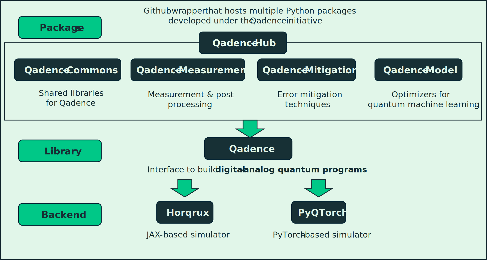

# Qadence-Hub


**Qadence-Hub** is a Github monorepo that hosts multiple Python packages developed under the **Qadence** initiative. It is structured to support independent development, testing, and deployment of each quantum features while maintaining a unified development environment. **Qadence-Hub** documentations is [here](https://pasqal-io.github.io/qadence-hub/latest/)


[](https://github.com/pasqal-io/qadence-hub/actions/workflows/lint.yml)
[](https://github.com/pasqal-io/qadence-hub/actions/workflows/test.yml)
[](https://pasqal-io.github.io/qadence-hub/latest)
[](https://opensource.org/licenses/Apache-2.0)

## Qadence-Hub structure

<p align="center">
  <picture>
    
  </picture>
<p align="center">

## 📦 Qadence extension packages

| Name | Description |
|------|-------------|
| [`qadence-commons`](https://pasqal-io.github.io/qadence-hub/qadence-commons/latest/) | Shared libraries for Qadence​|
| [`qadence-mitigation`](https://pasqal-io.github.io/qadence-hub/qadence-mitigation/latest/) | Tools for error mitigation in quantum circuit execution|
| [`qadence-measurement`](https://pasqal-io.github.io/qadence-hub/qadence-measurement/latest/) | Interfaces for executing and analyzing quantum measurement|
| [`qadence-model`](https://pasqal-io.github.io/qadence-hub/qadence-model/latest/) | Quantum ML models built on variational quantum circuits|

## Contribution Guide for Developers

Before making a contribution, please review our [code of conduct](docs/CODE_OF_CONDUCT.md).

- **Submitting Issues:** To submit bug reports or feature requests, please use our [issue tracker](https://github.com/pasqal-io/qadence-hub/issues).
- **Developing in qadence:** To learn more about how to develop within `qadence-hub`, please refer to [contributing guidelines](docs/contributing.md).

We have structured `qadence-hub` as a monorepo that includes several internal packages. The `qadence-hub` repository serves as the manager that oversees the source code, documentation, and distribution of all these packages. However, the `qadence-hub` itself is not packaged as a standalone module. Each package that is intended to be used alongside `qadence` is located within its own project folder under the hub repository.

Therefore, to update an individual package rather than the Hub (root) level, please follow the steps below.

### Setup with downloading the whole git repository

To work with qadence-hub, you should clone the entire GitHub repository and then access the individual projects. This approach is recommended for easier branch management, and cloning only a specific project is discouraged. After cloning the full repository, navigate to the desired project folder to run the Hatch environment or make code modifications. The example code snippet is like below:

```shell
git clone https://github.com/pasqal-io/qadence-hub.git
cd qadence-hub/qadence-model
```

### Making Pull Request

If you’ve modified the code of a specific package, you should create a pull request targeting the `sub-main branch` of that package. Our branch structure manages each package through its corresponding `sub-main branch` before anything is merged into the `main branch`. Therefore, after cloning the repository, you should follow your previous workflow to create a local branch and push it—but your pull request target should be your `sub-main branch`, not `main`. We currently have four sub-main branches; `main-commons`, `main-mitigation`, `main-measurement`, and `main-model`.

After your branch is merged to `sub-main branch`, you can initiate merge request to the `main branch`. Merging into `main branch` should be done only when a release is being prepared. In the `sub-main branches`, tests are run only for the corresponding package, but when merging into main, tests are executed for all packages within `qadence-hub`. Therefore, we recommend managing your package in its `sub-main branch` during regular development, and only pushing to main when necessary.

### Releasing Projects and Publishing to PyPI

We publish each package separately. After you merge your `sub-main branch` to `main branch`, you can publish your documents and Python package through release. To do this, you need to update the version number in the package's `pyproject.toml`. Then, you create a release with the format of `package_name-v.x.y.z,` where x, y, and z are for version numbers. For example, if you want to publish `qadence-model` with version 1.2.5, you must put `model-v1.2.5` as your release name.


## License
Qadence-Hub is a free and open source software package, released under the Apache License, Version 2.0.
