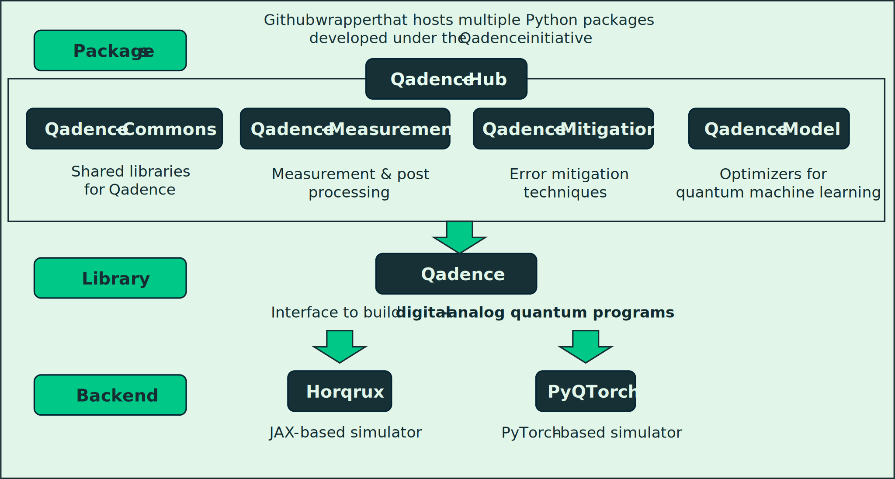

# Qadence Hub Overview

Welcome to the documentation for the **Qadence Hub**.
This repository contains multiple modular Python packages developed on top of **Qadence** features.

## Qadence Hub Structure

  <picture>
    
  </picture>

## List of Hub Packages

- [**qadence-commons documentation**](https://pasqal-io.github.io/qadence-hub/qadence-commons/latest/): Shared quantum utilities library in Qadence
- [**qadence-mitigation documentation**](https://pasqal-io.github.io/qadence-hub/qadence-mitigation/latest/): Quantum error mitigation techniques
- [**qadence-measurement documentation**](https://pasqal-io.github.io/qadence-hub/qadence-measurement/latest/): Quantum output measurement methods
- [**qadence-model documentation**](https://pasqal-io.github.io/qadence-hub/qadence-model/latest/): Quantum constructors for various blocks and ansätze.

## Package Source Code Links

- [**qadence-commons source code**](https://github.com/pasqal-io/qadence-hub/tree/main/qadence-commons)
- [**qadence-mitigation source code**](https://github.com/pasqal-io/qadence-hub/tree/main/qadence-mitigation)
- [**qadence-measurement source code**](https://github.com/pasqal-io/qadence-hub/tree/main/qadence-measurement)
- [**qadence-model source code**](https://github.com/pasqal-io/qadence-hub/tree/main/qadence-model)

## Development Resources

- [Setup Guide](hub/setup.md)
- [Testing](hub/test.md)

## Directory Conventions

- Use `project_name/` layout inside each module for source codes
- Tests should live in `tests/` inside each module
- Documentation should reside in the root `docs/` or module-specific docs
